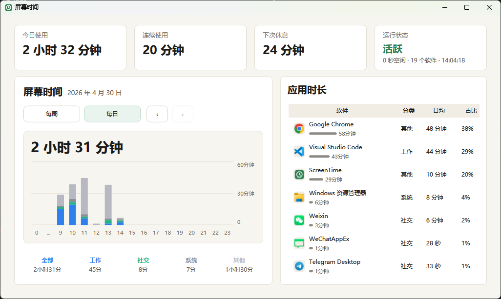
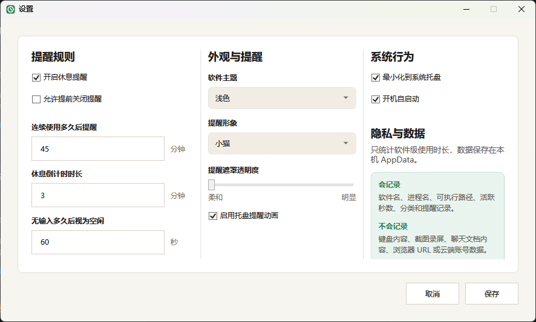

# 屏幕时间

一款轻量的 Windows 屏幕时间工具，专注统计本机软件使用时长，并在连续使用过久时用温和的全屏提醒提示你休息。

## 下载

[下载 Windows 版](https://github.com/wanxb/screen-time/releases/latest/download/ScreenTime-v0.1.3-win-x64.zip)

下载压缩包后解压，运行 `ScreenTime.exe` 即可，不需要额外安装 .NET 运行环境。

## 预览





## 功能

- 统计今日和每周的软件使用时长
- 按工作、社交、娱乐、学习、系统、其他分类查看占比
- 支持连续使用提醒、休息倒计时和全屏提醒遮罩
- 支持托盘常驻、托盘动画、最小化到托盘
- 支持浅色、深色、跟随系统主题
- 支持开机自启动
- 数据保存在本机 AppData，不上传云端

## 隐私

屏幕时间只记录软件名、进程名、可执行路径、活跃秒数、分类和提醒记录。不会记录键盘输入、截图录屏、聊天文档内容、浏览器 URL 或账号数据。

## 开发

```powershell
dotnet build src\ScreenTime\ScreenTime.csproj
dotnet run --project src\ScreenTime\ScreenTime.csproj
```

## 测试

```powershell
dotnet build tests\ScreenTime.Tests\ScreenTime.Tests.csproj
tests\ScreenTime.Tests\bin\Debug\net8.0-windows\ScreenTime.Tests.exe
```
